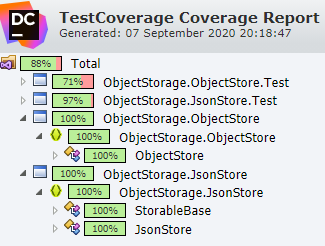

# Coding Challenge

This coding challenge is a C# based challenge for to implement a file-based JSON object store as .NET Standard 2.0 libraries.

The specification of the challenge can be found [here](Challenge.md).

## IStore implementation

The basic store has been implemented as a .NET Standard 2.0 library called `ObjectStorage.JsonStore`. It contains the required interfaces to code against and an implementation of `IStore`, called `JsonStore`. There's also a very basic implementation of `IStorable` called `StorableBase` because the JSON Serializer used requires a fixed type to create, which can't be an interface.

In a larger application, I would have also created a custom exception to throw rather than re-purpose the `KeyNotFoundException`. I'm aware that the properties returned are always of type `JsonElement` which may not be ideal but given the challenge, thought this would be better to return so the consumer can deal with the types however they like.

I chose to use `System.Text.Json` over `Newtonsoft.Json` because I've not used it before and thought this would be a great opportunity to become familiar with it.

## IObjectStore implementation

The generic object storage has also been implemented as a .NET Standard 2.0 library called `ObjectStorage.ObjectStore`.

I wasn't sure how much error handling should be done, so have left a majority of it out. The items I'd consider and ask for requirements on mainly would be the following:

- What if the ID from the filename doesn't match the ID in the file contents? Should it be checked and throw an error if not?
- Should the schema be validated before being deserialized from the file? Should it just use the defaults if values are missing in the file and ignore any extra properties on the object? (This is the approach that is currently used)

I attempted to build the items by creating an instance of the type then setting the properties according to the values at first, however, the types returned by the properties are of type `JsonElement` rather than the actual types. This means there needs to be more logic to do this properly. This is likely a limitation of the `JsonStore` project. However, serializing the properties and then deserializing to the type is an approach which works and takes care of most of that (albeit maybe not the best approach). I've left some commented out code of an example of how I'd build the instance of the type to return, just for completeness.

## Testing

Unit tests have been written to cover the requirements provided to ensure that all required functionality is present.

I chose to use xUnit to write the tests since it's something I've been meaning to use for a while and this challenge presented an opportunity to use it. I've used NUnit 3 more heavily in the past and transitioning to xUnit was quite easy, even if I'm not making full use of all of it's features.

The format of the tests follow a GivenASituation_ThisActionShouldHappen format.

A report of the test coverage can be found [here](TestCoverage.zip).

## What I'd do differently next time

- I'd change the interface to expose 'Async' variants of most of the methods also so that serialization and IO operations are non-blocking
- I'd spend more time investigating how the properties should be returned instead of JsonElements (and if they need to be)
- I'd add the custom exception rather than re-purpose existing exceptions
- I'd add XML comments to public methods exposed in the library
- Get requirements for, and add, extra error handling. (e.g. should file access exceptions return the ones thrown by the `File` object or should they be caught and re-thrown as a custom type?)
- Get requirements for whether reading one object as another type should throw or just try it's best to set the type
  - Throwing would be more difficult to implement - could add a "type" property somehow?
  - Not throwing would be beneficial because it would allow for the Car/Book objects to change and have a best guess at reading the data. Plus, some fields are nullable etc.
- Update the interfaces so the properties on `Car` and `Book` are readonly, settable once by a constructor so that the `GetHashCode` method would work reliably.
- Potentially, write and use a FileProvider implementation that can be mocked during testing so that unit tests don't actually write files to disk
